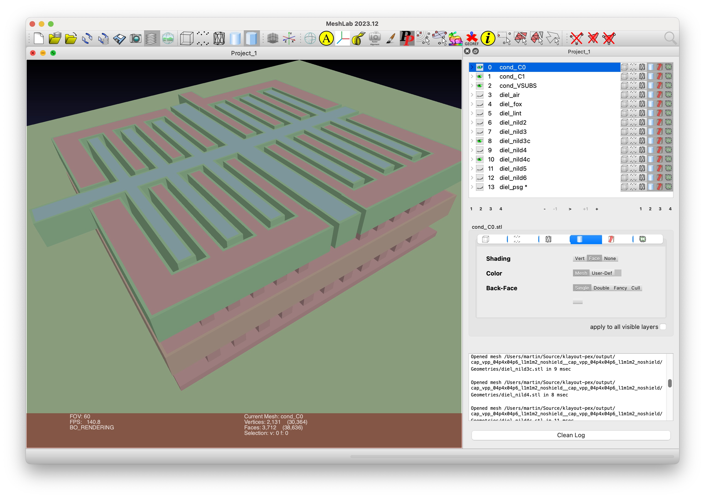

::: {.content-hidden}
Copyright (C) 2024-2025 Martin Köhler and co-authors (martin.koehler@jku.at)

Licensed under the Apache License, Version 2.0 (the "License");
you may not use this file except in compliance with the License.
You may obtain a copy of the License at

    http://www.apache.org/licenses/LICENSE-2.0

Unless required by applicable law or agreed to in writing, software
distributed under the License is distributed on an "AS IS" BASIS,
WITHOUT WARRANTIES OR CONDITIONS OF ANY KIND, either express or implied.
See the License for the specific language governing permissions and
limitations under the License.
:::

# First Steps

- The command line tool `kpex` is used to trigger the parasitic extraction flow from the terminal.
- Get help calling `kpex --help`.

## Example Layouts

Example layouts are included in the `testdata/designs` subdirectory of the KLayout-PEX source code:
```bash
git clone https://github.com/iic-jku/klayout-pex.git 

# for sky130A
find testdata/designs/sky130A -name "*.gds.gz"

# for IHP SG13G2
find testdata/designs/ihp_sg13g2 -name "*.gds.gz"
```

## Generating PEX25D {#sec-first-steps-pex25d}

`kpex pex25d` generates a PEX25D geometry and material description without running a solver. It is separate from the analytical KPEX/2.5D engine. See @sec-pex25d for the format specification, benefits, and standalone tools.

From the KLayout-PEX source directory:

```bash
kpex pex25d --pdk sky130A --blackbox y \
  --gds testdata/designs/sky130A/nmos_diode2/nmos_diode2.gds.gz \
  --output_file nmos_diode2.pex25d \
  --output_scene nmos_diode2.pex25d.scene.pb
```

The `.pex25d` file contains the text representation. The `.pex25d.scene.pb` file contains the resolved protobuf scene, including absolute layer heights and terminal intersections. Generation runs the reference validator by default; diagnostics determine the exit code even when output files have been written.

Use the standalone tool to inspect or validate an artifact:

```bash
pex25d show nmos_diode2.pex25d
pex25d validate nmos_diode2.pex25d --strict
```

For a complete, hand-written file that can be validated and exported without layout generation, use the downloadable example in @sec-pex25d-example. Terminal semantics and the current state of KLayout-generated terminals are explained in @sec-pex25d-terminals.

::: {.callout-note title="Current Sky130 stack validation"}
The current default Sky130 dielectric stack can report `PEX25D-E0260` for `nild6`/`capild` anchoring, including with the layout above. Generated files should not be treated as validated solver input when the command fails. See @sec-pex25d-generate for the diagnostic and a limited terminal-testing workaround.
:::

## Running the `KPEX/FasterCap` engine {#sec-first-steps-run-fastercap-engine}

Preconditions:

- `klayout-pex` was installed, see @sec-intro-installation
- `FasterCap` was installed, see @sec-intro-installation

::: {.callout-note}
Normally, devices with SPICE [@Nagel_1975] simulation models (e.g. like MOM-capacitors[^abbrev-mom] in the sky130A PDK) are ignored ("blackboxed") during parasitic extraction.

`kpex` has an option `--blacklist n` to allow extraction of those devices (whiteboxing), which can be useful during development (during the prototype phase, whiteboxing is actually the default setting, so please use `--blacklist y` to explicitly configure blackboxing).
:::

Let's try the following:
```bash
kpex --pdk sky130A --blackbox n --gds \
  testdata/designs/sky130A/*/cap_vpp_04p4x04p6_l1m1m2_noshield.gds.gz
```

::: {.callout-note}
This will report an error that we have not activated one or more engines, and list the available engines:

| Argument         | Description                             |
|:---------------- |:--------------------------------------- |
| `--fastercap`    | Run kpex/FasterCap engine               |
| `--2.5D`         | Run kpex/2.5D engine                    |
| `--magic`        | Run MAGIC engine                        |
:::

Now, to run the FasterCap engine (might take a couple of minutes):
```bash
kpex --pdk sky130A --blackbox n --fastercap --gds \
  testdata/designs/sky130A/*/cap_vpp_04p4x04p6_l1m1m2_noshield.gds.gz
```

Within the output directory (defaults to `output`), `KPEX` creates a subdirectory `Geometries`, containing STL-files that provide a preview of the `FasterCap` input geometries.
Use `MeshLab` (see @sec-intro-meshlab) to open and preview those files:
```bash
ls -d output/cap_vpp_04*/Geometries/*.stl
```

::: {.callout-tip}
- Open the `*.stl` files in `MeshLab`
- Use the eye buttons to hide and show each file/mesh
- Use the align tool ("A" in the toolbar) to assign different colors 
- Start by showing only on the conductors (files named `cond_*.stl`)
- Then try showing different dielectrics (files named `diel_*.stl`), to see how they surround the conductors.

{fig-alt="MOM Capacitor 3D Model"}
:::

In the log file, we see the output of FasterCap including the Maxwell capacitance matrix:

```
Capacitance matrix is:
Dimension 3 x 3
g1_VSUBS  5.2959e-09 -4.46971e-10 -1.67304e-09
g2_C1  -5.56106e-10 1.5383e-08 -1.47213e-08
g3_C0  -1.69838e-09 -1.48846e-08 1.64502e-08
```

`KPEX` interprets this matrix and prints a CSV netlist, which can be pasted into a spreadsheet application:

```csv
Device;Net1;Net2;Capacitance [fF]
Cext_0_1;VSUBS;C1;0.5
Cext_0_2;VSUBS;C0;1.69
Cext_1_2;C1;C0;14.8
Cext_1_1;C1;VSUBS;0.08
```

In addition, a SPICE netlist is generated.

## Running the `KPEX/MAGIC` engine {#sec-first-steps-run-magic-engine}

Preconditions:

- `klayout-pex` was installed, see @sec-intro-installation
- `magic` was installed, see @sec-intro-installation

The magic section of `kpex --help` describes the arguments and their defaults. Important arguments:

- `--magicrc`: specify location of the `magicrc` file
- `--gds`: path to the GDS input layout
- `--magic`: enable magic engine

```bash
kpex --pdk sky130A --magic --gds \
  testdata/designs/sky130A/*/cap_vpp_04p4x04p6_l1m1m2_noshield.gds.gz
```
