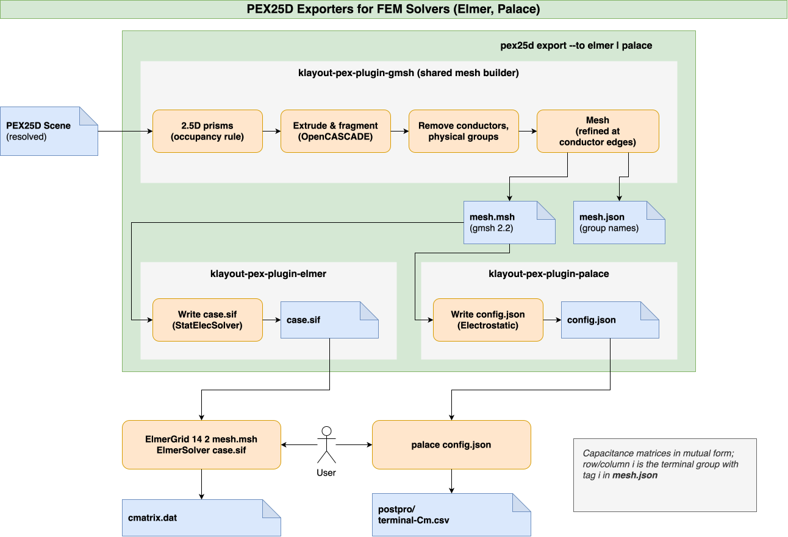

::: {.content-hidden}
Copyright (C) 2026 Martin Köhler and co-authors (martin.koehler@jku.at)

Licensed under the Apache License, Version 2.0 (the "License");
you may not use this file except in compliance with the License.
You may obtain a copy of the License at

    http://www.apache.org/licenses/LICENSE-2.0

Unless required by applicable law or agreed to in writing, software
distributed under the License is distributed on an "AS IS" BASIS,
WITHOUT WARRANTIES OR CONDITIONS OF ANY KIND, either express or implied.
See the License for the specific language governing permissions and
limitations under the License.
:::

## Plugin API {#sec-plugin-api}

`KPEX` can be extended by plugins, which are separate Python packages. Once a plugin is installed (e.g. via `pip3`), `KPEX` finds it automatically, there is no need to change or re-install `KPEX` itself.

{#fig-kpex-plugin-api-overview}

### PEX25D Importers and Exporters {#sec-plugin-api-importers-exporters}

Currently, there are two extension points, both built around the PEX25D format (see @sec-pex25d):

| Extension Point | PEX25D Importer | PEX25D Exporter |
|:--------------------|:------------------------------|:------------------------------|
| Description | Translate the scene description of another tool into a `PEX25DFile` | Write the input files of a solver from a resolved `PEX25DScene` |
| Input | Files of another tool, e.g. OpenRCX Universal Pattern Format | `PEX25DScene` protobuf |
| Entry Point Group | `klayout_pex.importers.v1` | `klayout_pex.exporters.v1` |
| Protocol | `PEX25DImporter` | `PEX25DSceneExporter` |
| CLI Invocation | `pex25d import --from NAME` | `pex25d export --to NAME` |
| Built-In Plugins | `openrcx-uf` (stub) | `fastercap`, `fastcap2`, `stl` |
| Maintained External Plugins | none yet | `elmer`, `palace`, `gmsh` (see @sec-plugin-api-fem) |

Running the solver and reading its results back into `kpex extract` is not part of the plugin API yet, this is planned for a future version.

::: {.callout-caution}
The plugin API `v1` is provisional: it is currently tested together with colleagues, and may still change until it is declared stable. Afterwards, breaking changes will get a new version `v2`, with their own entry point groups.

Plugins should therefore pin `klayout-pex` to one minor release, e.g. `>=0.6.3,<0.7`.
:::

### Using Plugins {#sec-plugin-api-using}

```bash
pip3 install --upgrade klayout-pex-plugin-palace

pex25d plugins     # overview: selector, package, version, description
pex25d exporters   # selectors only, one per line (for scripts)
pex25d importers
```

`pex25d plugins` only reads the package metadata, a plugin itself is loaded when it is used. A plugin that fails to load (e.g. because of a missing dependency) therefore does not affect the other ones.

Selecting a plugin:

- by its name, e.g. `--to palace`
- by `package:name`, if two packages provide the same name, e.g. `--to klayout-pex:stl`
- built-in plugins take precedence for plain names

Plugin specific options are passed with `--option NAME=VALUE` (since `klayout-pex` 0.6.3). The value is read as JSON if possible (`10`, `1e-9`, `true`), otherwise as text:

```bash
pex25d export cell.pex25d --to palace --out_dir deck \
  --option mesh_size_edge_um=0.2 --option order=2
```

| Exit status | Meaning |
|:--|:--|
| `2` | Unknown plugin, invalid option, or the plugin rejected its input |
| `3` | The plugin does not implement the requested feature yet |
| `4` | Unexpected plugin failure (`--log_level debug` shows the traceback) |

### Writing a Plugin {#sec-plugin-api-writing}

A plugin is a Python package, which registers a factory function under one of the entry point groups. The factory is called without arguments and returns an object implementing the protocol. The protocols are defined in `klayout_pex.plugin_api.v1`, deriving from them is optional.

For the plugins maintained by us, we use these conventions:

- GitHub repository and PyPI package: `klayout-pex-plugin-<name>`
- Python package: `klayout_pex_plugins.<name>`
  - `site-packages/klayout_pex_plugins` is a namespace package shared by all plugins
  - it must not contain an `__init__.py`, otherwise all other plugins become invisible

The registration in `pyproject.toml`:

```toml
[project]
name = "klayout-pex-plugin-example"
dependencies = ["klayout-pex>=0.6.3,<0.7"]

[project.entry-points."klayout_pex.exporters.v1"]
nets = "klayout_pex_plugins.example:create_exporter"
```

General rules for plugins:

- import heavy dependencies (e.g. a mesh generator) only when the plugin is used, not when its module is imported
- check the names and values of the options, raise `ExportError` / `ImporterError` for invalid options or unsupported input
- raise `ExporterUnavailable` / `ImporterUnavailable` when a dependency is missing, e.g. native binaries or libraries
- raise `NotImplementedError` for features that are not implemented yet
- do not modify the scene or the options passed in

### PEX25D Exporters {#sec-plugin-api-exporters}

An exporter writes the input files of a solver from a resolved `PEX25DScene` (see @sec-pex25d-workflow), it does not run the solver:

```python
class PEX25DSceneExporter(Protocol):
    def export(self,
               scene: PEX25DScene,
               *,
               output_dir_path: str,
               prefix: str = '',
               options: Optional[Mapping[str, Any]] = None) -> List[str]:
        ...
```

- `scene`: the resolved scene (`pex25d export` resolves a `PEX25DFile` first)
- `output_dir_path`: the directory for the files, the exporter creates it if necessary
- `prefix`: prefix for the file names, an empty prefix means the exporter's own default
- `options`: exporter specific options, e.g. from `--option`
- returns the paths of the files written, the main input file first

A minimal exporter, which writes the net of each conductor into a text file:

```python
import os
from typing import Any, List, Mapping, Optional

from klayout_pex.plugin_api.v1 import ExportError, PEX25DSceneExporter


class NetsExporter(PEX25DSceneExporter):
    def export(self, scene, *, output_dir_path: str, prefix: str = '',
               options: Optional[Mapping[str, Any]] = None) -> List[str]:
        if options:
            raise ExportError(f"unknown options: {', '.join(options)}")
        os.makedirs(output_dir_path, exist_ok=True)
        path = os.path.join(output_dir_path, f"{prefix}nets.txt")
        with open(path, 'w') as file:
            for conductor in scene.conductors:
                file.write(f"{conductor.name} {conductor.net}\n")
        return [path]


def create_exporter() -> NetsExporter:
    return NetsExporter()
```

#### Example: FEM Solvers Elmer and Palace {#sec-plugin-api-fem}

As examples for external exporters, we provide plugins for two open source FEM field solvers, both used for capacitance extraction (electrostatics):

- [klayout-pex-plugin-elmer](https://github.com/iic-jku/klayout-pex-plugin-elmer): exporter `elmer` for [Elmer FEM](https://www.elmerfem.org) (`StatElecSolver`)
- [klayout-pex-plugin-palace](https://github.com/iic-jku/klayout-pex-plugin-palace): exporter `palace` for [Palace](https://awslabs.github.io/palace/) (`Electrostatic` problem)
- both use the volume mesh of [klayout-pex-plugin-gmsh](https://github.com/iic-jku/klayout-pex-plugin-gmsh), which is also available as exporter `gmsh`

{#fig-kpex-plugin-fem-exporters}

The mesh is built in these steps:

- 2.5D prisms: the domain is sliced at every z where a solid starts or ends
  - within each slab, conductors and the ground plane come first, then the dielectrics by wrap depth (see @sec-pex25d-dielectrics), and the background fills the rest
  - so the prisms fill the domain exactly once
- the prisms are extruded and fragmented using `OpenCASCADE`, so touching solids share their faces
- the conductors are removed, only their surfaces remain, as one physical group per net
- the elements are refined at the conductor edges, where the field concentrates
  - by default, down to the thickness of the thinnest conductor layer

Elmer FEM:

```bash
pip3 install --upgrade klayout-pex-plugin-elmer

pex25d export cell.pex25d --to elmer --out_dir elmer
cd elmer
ElmerGrid 14 2 mesh.msh -autoclean   # gmsh mesh -> Elmer mesh
ElmerSolver case.sif                 # writes cmatrix.dat
```

Palace:

```bash
pip3 install --upgrade klayout-pex-plugin-palace

pex25d export cell.pex25d --to palace --out_dir palace
cd palace
palace -np 4 config.json             # writes postpro/terminal-Cm.csv
```

Both solvers write the capacitance matrix in mutual form:

- off-diagonal cells contain the coupling capacitance between two terminals
- diagonal cells contain the capacitance to ground (zero, unless the outer boundary is grounded)
- row/column $i$ belongs to the terminal group with tag $i$ in `mesh.json` (nets, floating conductors, ground plane)

The options of the plugins (mesh sizes, element order, outer boundary condition, …) are listed in the `README` files of the repositories.

::: {.callout-note title="IIC-OSIC-TOOLS"}
The `IIC-OSIC-TOOLS` Docker image (see @sec-intro-installation) contains Palace, Elmer FEM is not included yet. When running as `root`, call `palace -serial config.json`, as `mpirun` refuses to run as `root`.
:::

For the test design `overlap_plates_100um_x_100um_m1_m2` (`ihp-sg13g2`, two plates of 100 µm × 100 µm in `Metal1` and `Metal2`, overlapping by 50 µm × 50 µm), the coupling capacitance between the plates is:

| Solver | Mesh | $C_{LOWER,UPPER}$ |
|:--|:--|--:|
| Elmer FEM | default (94k tetrahedra) | 181.3 fF |
| Palace, order 1 | same mesh | 181.3 fF |
| Palace, order 2 | same mesh | 179.4 fF |
| Elmer FEM | edges refined to 0.21 µm (~180k tetrahedra) | 180.7 fF |

A parallel plate estimate of the overlap alone gives 168 fF, the difference being the fringe capacitance.
